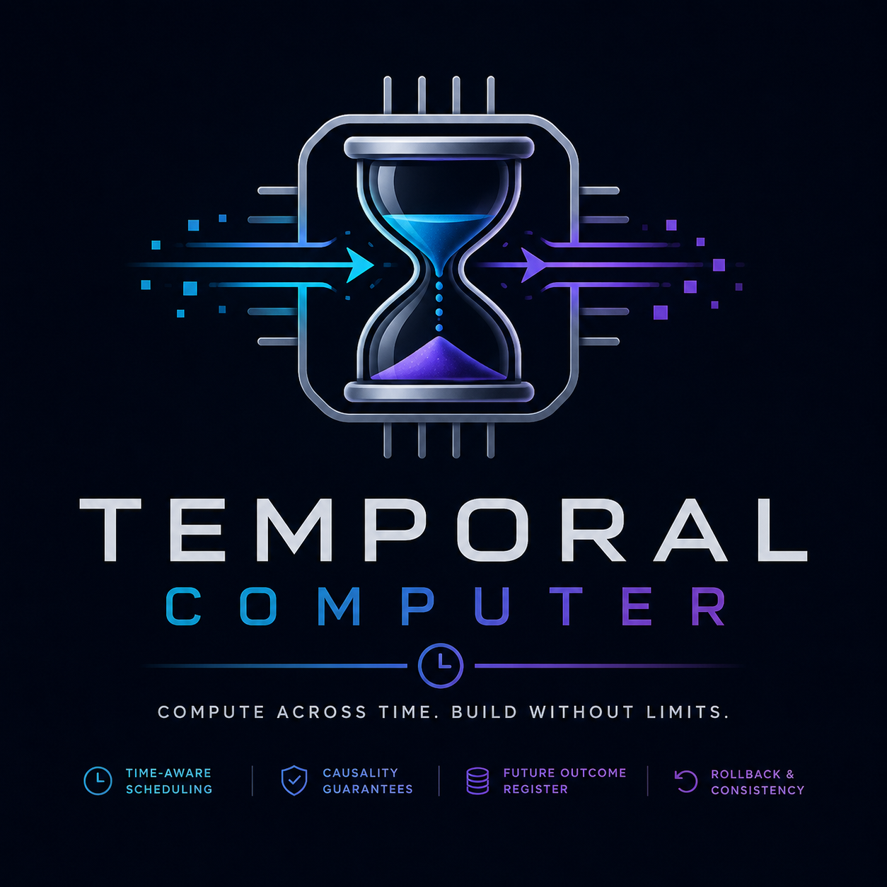
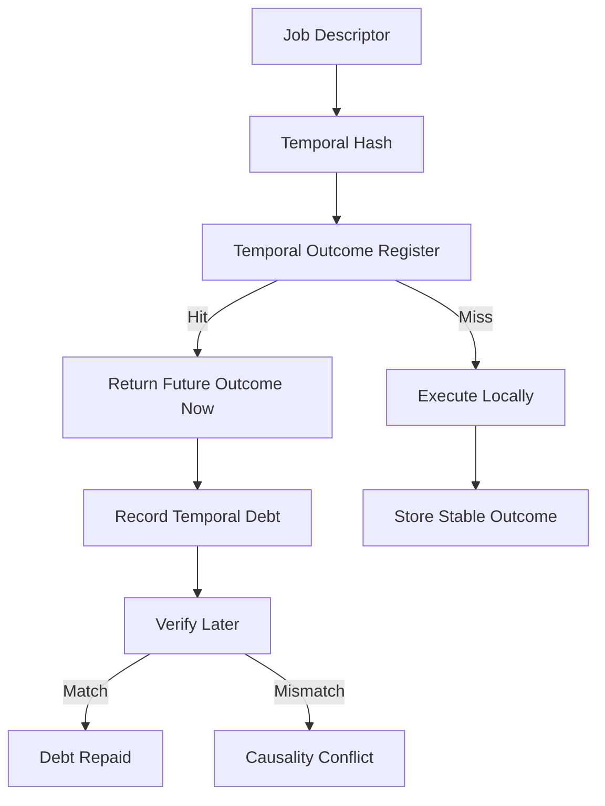

# Temporal Computer

A speculative Python simulator for a computer where **time is treated as a schedulable resource**.

The project explores a fictional-but-useful architecture built around:

- temporal hashes
- a Temporal Outcome Register
- future outcome lookup
- causality debt
- conflict detection
- rollback-oriented thinking

It does **not** implement real time travel. It is a systems-design playground for ideas related to deterministic build systems, speculative execution, CI acceleration, reproducible computation, and future-result validation.

## Core Idea

```text
hash(job + input state + scheduled future time + environment)
  -> known future outcome
```

If a future outcome is already known, the scheduler may return it immediately, but it records a **temporal debt**. That debt must later be repaid by executing the same job and verifying that the result matches.



## Quickstart

```bash
python -m temporal_computer.demo
```

## CLI Prototype

Install the package locally, then use either the `temporal` console script or `python -m temporal_computer.cli`.

```bash
python -m pip install -e '.[dev]'
temporal demo
```

Create a job descriptor:

```json
{
  "job_name": "compile",
  "input_state": {
    "code": "int main() { return 0; }"
  },
  "target_time": "T+5m",
  "environment": {
    "compiler": "toy-cc-1.0"
  }
}
```

Compute its temporal hash:

```bash
temporal hash job.json
```

Register a future outcome:

```json
{
  "job": {
    "job_name": "compile",
    "input_state": {
      "code": "int main() { return 0; }"
    },
    "target_time": "T+5m",
    "environment": {
      "compiler": "toy-cc-1.0"
    }
  },
  "result": {
    "status": "ok",
    "artifact": "game-build-42"
  },
  "stable": false,
  "provenance": "future packet"
}
```

Then consume it and inspect temporal debt:

```bash
temporal register-put outcome.json
temporal schedule job.json
temporal debts-list
```

CLI state is stored under `.temporal/` as JSONL files.

## Tests

```bash
python -m pip install -e '.[dev]'
python -m pytest
```

## Repository Structure

```text
temporal_computer/
  cli.py                command-line prototype
  hashing.py            deterministic temporal hash
  outcome_register.py   content-addressed future outcomes
  persistence.py        JSONL persistent store
  scheduler.py          scheduler + debt validation
  demo.py               minimal working example

docs/
  ARCHITECTURE.md       detailed architecture
  CONCEPTS.md           design concepts from the discussion
  MERMAID.md            diagram collection
  ROADMAP.md            next technical steps

codex/
  NEXT_MOVE_PROMPT.md   prompt for Codex to continue the repo
  FOLLOWUP_PROMPTS.md   future Codex tasks
```

## Why This Is Interesting

The fictional time-machine framing maps surprisingly well onto real engineering problems:

| Time-computer concept | Real-world analogy |
|---|---|
| Future outcome | cached or predicted result |
| Temporal hash | content-addressed build key |
| Temporal debt | deferred verification obligation |
| Paradox | cache invalidation or nondeterminism |
| Rollback barrier | transaction boundary |
| Temporal scheduler | predictive CI/build scheduler |

## Documentation

Start here:

- [Architecture](docs/ARCHITECTURE.md)
- [Concepts](docs/CONCEPTS.md)
- [Mermaid diagrams](docs/MERMAID.md)
- [Roadmap](docs/ROADMAP.md)
- [Codex next move](codex/NEXT_MOVE_PROMPT.md)

## License

Apache-2.0. See [LICENSE](LICENSE).
