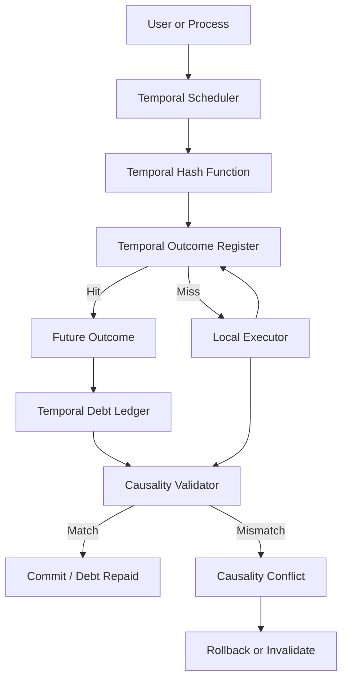
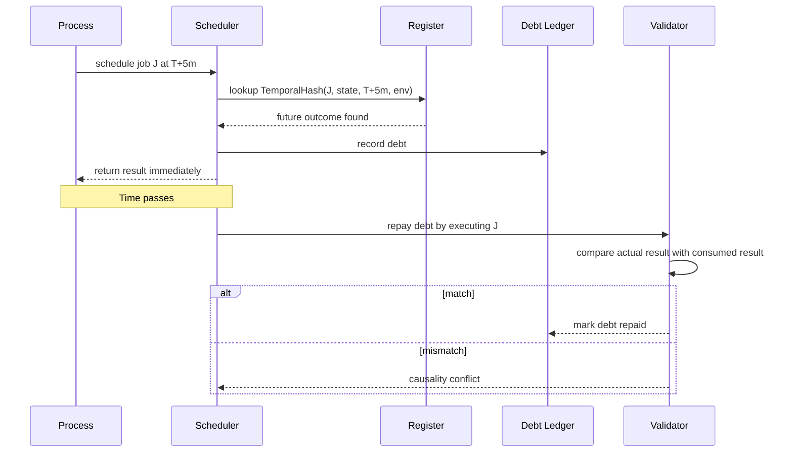
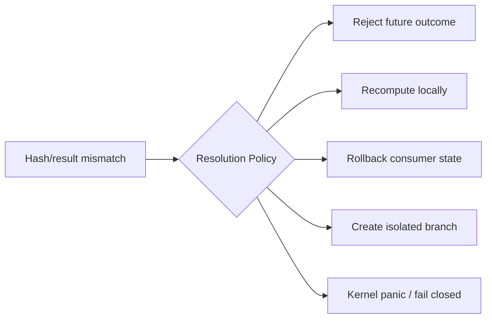

# Temporal Computer Architecture

## Purpose

Temporal Computer is a speculative architecture and simulator for a computer that treats **time** as a schedulable resource, alongside CPU, memory, disk, and network.

The project does **not** claim that physical time travel is possible. It uses the idea as a design lens for building systems that resemble:

- deterministic build systems
- speculative execution engines
- content-addressed caches
- reproducible pipelines
- transactional schedulers
- rollback-safe simulations

The central question is:

> What would an operating system look like if it could receive verified outcomes from future execution windows?

## Core Design

The system is built around a **Temporal Outcome Register**. The register maps a deterministic temporal hash to an outcome.

```text
TemporalHash(job, input_state, target_time, environment) -> Outcome
```

A scheduler can then ask:

> Has this computation already been observed in the future?

If yes, it may return the outcome immediately while recording a **temporal debt** that must later be repaid by executing the same computation and validating the result.

## High-Level System Diagram



## Components

### Temporal Hash

The temporal hash uniquely identifies a computation in a temporal context.

It must include more than the input data. It should also include execution context:

- job name
- input state
- target time or temporal offset
- environment metadata
- toolchain version
- OS/kernel version
- hardware model
- relevant entropy source state
- dependency graph

In code today:

```python
temporal_hash(
    job_name="compile",
    input_state={"code": "int main() { return 0; }"},
    target_time="T+5m",
    environment={"compiler": "toy-cc-1.0"},
)
```

### Temporal Outcome Register

The register is content-addressed storage for future outcomes.

It behaves like a combination of:

- CPU cache
- Git object store
- build cache
- blockchain-like ledger
- speculative execution result buffer

Important properties:

- write-once outcome entries
- deterministic lookup by temporal hash
- provenance metadata
- stable/speculative marker

### Temporal Scheduler

The scheduler decides whether a computation should:

1. consume a known future outcome,
2. execute locally now,
3. be scheduled into a future execution window,
4. be rejected because it would violate causality constraints.

Current toy behavior:

```text
if outcome exists:
    return future result immediately
    record debt
else:
    execute locally
    store stable outcome
```

Future behavior should support:

- priority queues
- temporal debt budgets
- rollback barriers
- speculative output labels
- per-process causal isolation

### Temporal Debt Ledger

If a process consumes a future result now, the system owes the future execution that produced it.

A debt records:

- temporal hash
- job name
- input state
- target time
- environment
- result consumed
- repayment status

When the target execution window arrives, the system re-runs the job and checks whether the actual result matches the result already used.

### Causality Validator

The validator checks whether a future result is consistent with later execution.



## Temporal Scheduling Model

A normal OS sees resources like this:

```text
CPU core 0, now
CPU core 1, now
RAM pages, now
Disk blocks, now
```

A temporal OS sees resources like this:

```text
CPU core 0 @ T-5m
CPU core 0 @ T
CPU core 0 @ T+5m
RAM page X @ T-5m
RAM page X @ T
RAM page X @ T+5m
Disk object Y @ T-5m
Disk object Y @ T
Disk object Y @ T+5m
```

This creates a 4D resource grid.

```mermaid
gantt
    title Temporal CPU Scheduling Sketch
    dateFormat  X
    axisFormat %s
    section Core 0
    Past validation      :done, 0, 2
    Current process      :active, 2, 4
    Future compile debt  :crit, 4, 6
    section Core 1
    Speculative sim      :active, 1, 5
    Idle / reserve       :5, 6
```



## Consistency Modes

The architecture should eventually support multiple consistency modes.

| Mode | Meaning | Use Case |
|---|---|---|
| strict-causal | Future result cannot be used unless fully locked | safety-critical work |
| speculative | Result may be used but requires rollback barrier | builds, tests, AI workloads |
| branchable | Mismatch creates isolated branch | simulations, game AI |
| eventual-temporal | System accepts temporary inconsistency | low-risk caching |

## Why Hashing Helps But Does Not Magically Solve Paradoxes

A temporal hash can detect inconsistency. It cannot force reality or execution to comply.

The hash answers:

> Is this outcome the one that corresponds to this scheduled computation?

It does not answer:

> Which branch is correct if the future result changes the actions that produce it?

So the hash must be paired with a policy engine:



## Practical Interpretation Without Time Travel

This project can be made useful by treating the time-travel idea as metaphorical infrastructure:

- future outcomes become cached build outputs
- temporal debt becomes deferred verification
- causality conflicts become cache invalidation bugs
- rollback barriers become transaction boundaries
- temporal scheduling becomes predictive CI orchestration

That makes the project relevant to real developer tooling.
