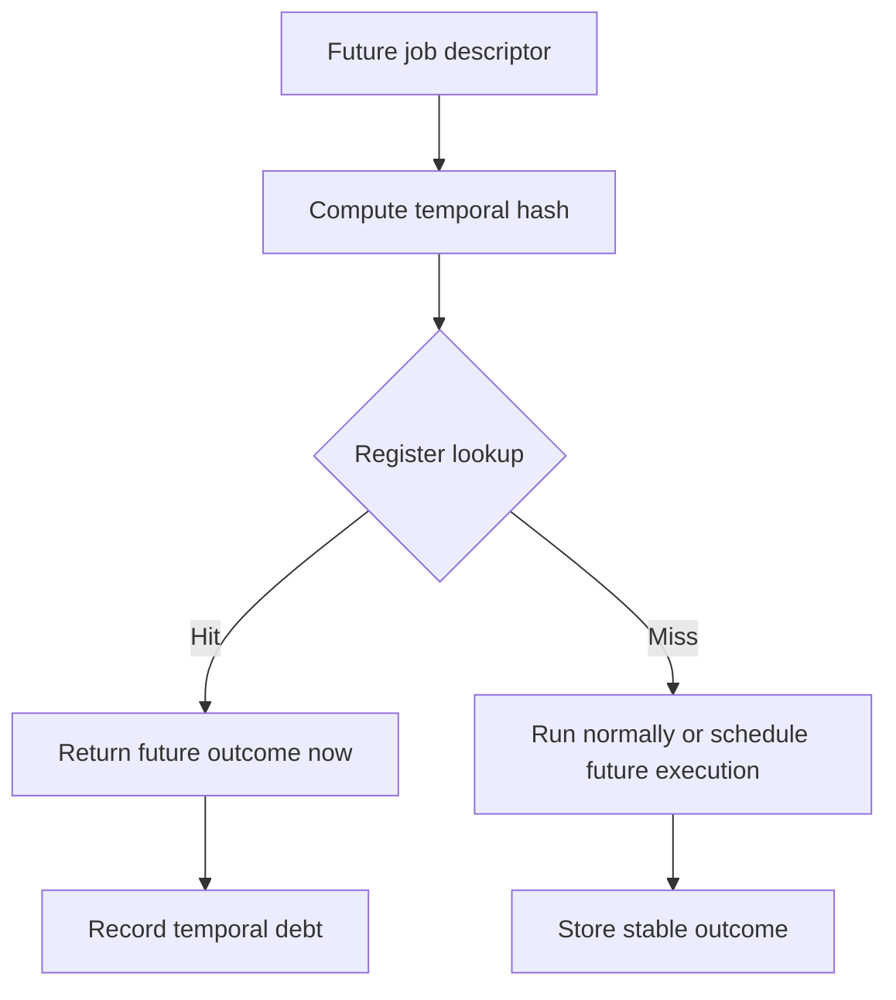

# Concepts From the Discussion

This document captures the design ideas behind Temporal Computer.

## Time as a Resource Dimension

The starting idea was a computer where CPU, RAM, and disk are optimized not only across space but across time.

Traditional resource dimensions:

```text
CPU cores
RAM capacity
Disk capacity
Network bandwidth
```

Temporal resource dimension:

```text
execution slots across time
```

The scheduler no longer asks only:

> Which process runs on which CPU core now?

It asks:

> Which process runs on which CPU core, at which time coordinate, with which memory and disk version?

## Temporal Outcome Register

The next key idea was a register that contains outcomes received from the future.

When something is scheduled in the future, its composition is hashed:

```text
H = hash(job + input state + future time + environment)
```

Then the system looks up `H` in the Temporal Outcome Register.



## Causality Debt

A future result is not free. If the system uses a result from `T+5m` at `T`, then the future execution at `T+5m` must still occur.

This creates a debt.

```text
used future outcome now -> must produce matching outcome later
```

If the later computation produces a different result, the system has a causality conflict.

## No Free Compute

The architecture does not create infinite compute.

It creates the appearance of instant results by borrowing from future execution slots.

This is similar to:

- zero-interest loans from your own future machine time
- speculative execution
- precomputed caches
- delayed verification

## No Infinite Money Glitch

The earlier cash-loop discussion clarified a core design principle:

> Closed causal loops do not create net value.

They can move resources in time but cannot create extra conserved resources.

The useful pattern is not resource duplication. The useful pattern is **asset utilization**.

## Asset Utilization Analogy

A skid loader on a construction site may sit idle 80% of the time. A temporal system could theoretically move that expensive asset only to moments where it is needed, raising utilization.

In computing terms:

- idle CPU becomes borrowable future CPU
- idle disk I/O becomes delayed throughput
- idle CI runners become predictive future build slots
- long game simulations become inspectable future outcomes

This is the real economic analogy: not making assets from nothing, but improving utilization.

## Game Development Use Cases

Temporal computation fits game development especially well because games are feedback-loop constrained.

Potential uses:

- instant build feedback
- future playtest simulation
- rollback debugging
- emergent AI balance testing
- deterministic save-game replay
- asset bake prediction
- CI pipeline acceleration


## Build System Interpretation

A realistic non-time-travel version of this project could become a build scheduler that combines:

- Nix/Bazel-style hashing
- remote cache lookup
- speculative execution
- CI result prediction
- deferred verification
- reproducibility enforcement

In that framing:

```text
future result = cached or predicted result
causality debt = obligation to verify prediction
paradox = cache invalidation or nondeterminism
```

## Dating and Ethics Notes

The discussion also explored ethical use of time travel for dating. The useful principle was:

> Use future knowledge to improve yourself and your judgment, not to manipulate another person.

Translated into engineering ethics:

> Use temporal power to reduce uncertainty and improve decisions, not to hide risk or fake capability.

That maps back to the system design:

- do not fake stable outcomes
- label speculative results clearly
- preserve provenance
- prefer rollback-safe behavior
- fail closed when consistency is unknown
