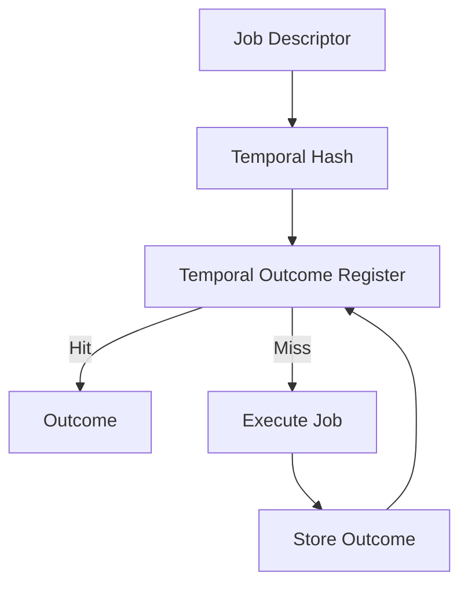
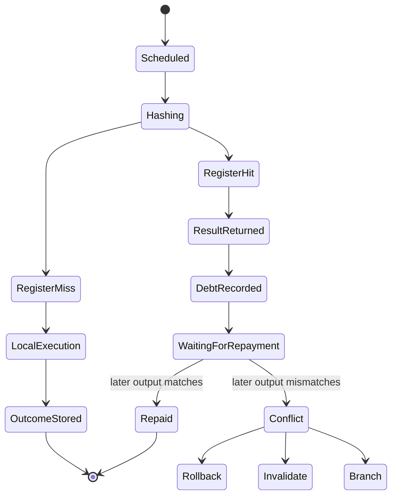
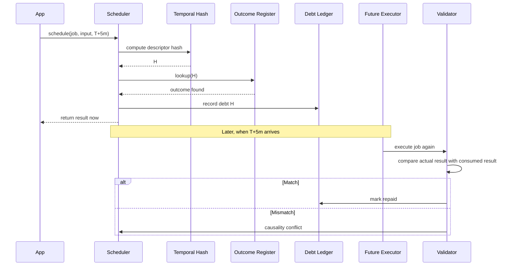
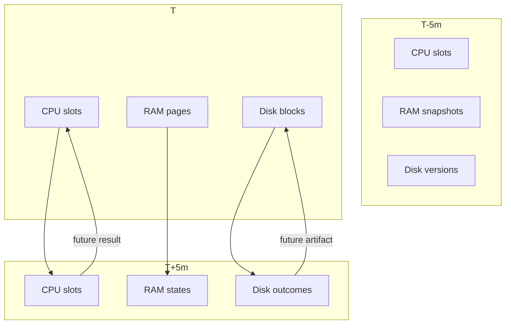
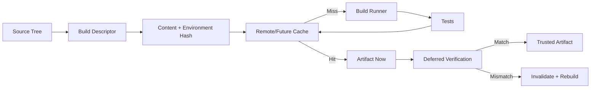
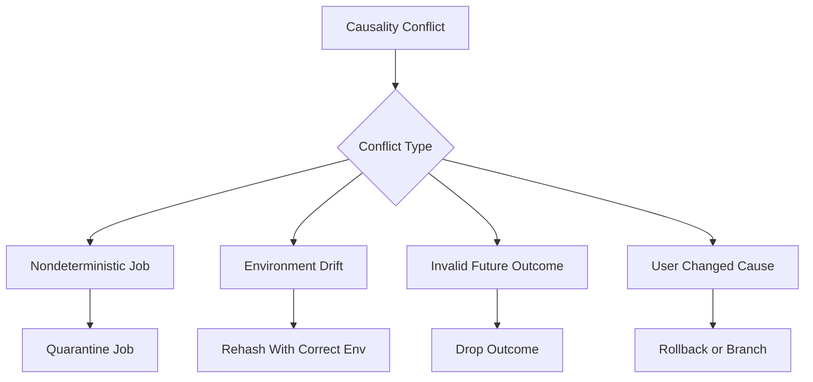

# Mermaid Diagrams

## Temporal Outcome Register

```mermaid
flowchart TD
    Job[Job Descriptor] --> Hash[Temporal Hash]
    Hash --> TOR[Temporal Outcome Register]
    TOR -->|Hit| Result[Outcome]
    TOR -->|Miss| Execute[Execute Job]
    Execute --> Store[Store Outcome]
    Store --> TOR
```

## Scheduler State Machine

```mermaid
stateDiagram-v2
    [*] --> Scheduled
    Scheduled --> Hashing
    Hashing --> RegisterHit
    Hashing --> RegisterMiss
    RegisterHit --> ResultReturned
    ResultReturned --> DebtRecorded
    DebtRecorded --> WaitingForRepayment
    WaitingForRepayment --> Repaid: later output matches
    WaitingForRepayment --> Conflict: later output mismatches
    RegisterMiss --> LocalExecution
    LocalExecution --> OutcomeStored
    OutcomeStored --> [*]
    Repaid --> [*]
    Conflict --> Rollback
    Conflict --> Invalidate
    Conflict --> Branch
```

## Temporal Debt Sequence

```mermaid
sequenceDiagram
    participant App
    participant Scheduler
    participant Hash as Temporal Hash
    participant TOR as Outcome Register
    participant Debt as Debt Ledger
    participant Exec as Future Executor
    participant Validator

    App->>Scheduler: schedule(job, input, T+5m)
    Scheduler->>Hash: compute descriptor hash
    Hash-->>Scheduler: H
    Scheduler->>TOR: lookup(H)
    TOR-->>Scheduler: outcome found
    Scheduler->>Debt: record debt H
    Scheduler-->>App: return result now

    Note over Scheduler,Exec: Later, when T+5m arrives

    Exec->>Validator: execute job again
    Validator->>Validator: compare actual result with consumed result
    alt Match
        Validator->>Debt: mark repaid
    else Mismatch
        Validator->>Scheduler: causality conflict
    end
```

## 4D Resource Grid

```mermaid
flowchart TB
    subgraph Past[T-5m]
        PCPU[CPU slots]
        PRAM[RAM snapshots]
        PDISK[Disk versions]
    end

    subgraph Now[T]
        NCPU[CPU slots]
        NRAM[RAM pages]
        NDISK[Disk blocks]
    end

    subgraph Future[T+5m]
        FCPU[CPU slots]
        FRAM[RAM states]
        FDISK[Disk outcomes]
    end

    NCPU --> FCPU
    NRAM --> FRAM
    NDISK --> FDISK
    FCPU -->|future result| NCPU
    FDISK -->|future artifact| NDISK
```

## Practical Build-System Mapping

```mermaid
flowchart LR
    Source[Source Tree] --> Descriptor[Build Descriptor]
    Descriptor --> Hash[Content + Environment Hash]
    Hash --> Cache[Remote/Future Cache]
    Cache -->|Hit| Artifact[Artifact Now]
    Cache -->|Miss| Runner[Build Runner]
    Runner --> Tests[Tests]
    Tests --> Cache
    Artifact --> Verify[Deferred Verification]
    Verify -->|Match| Trust[Trusted Artifact]
    Verify -->|Mismatch| Invalidate[Invalidate + Rebuild]
```

## Policy Engine

```mermaid
flowchart TD
    Conflict[Causality Conflict] --> Classify{Conflict Type}
    Classify --> Nondeterminism[Nondeterministic Job]
    Classify --> EnvDrift[Environment Drift]
    Classify --> BadFuture[Invalid Future Outcome]
    Classify --> UserMutation[User Changed Cause]

    Nondeterminism --> Quarantine[Quarantine Job]
    EnvDrift --> Rehash[Rehash With Correct Env]
    BadFuture --> Drop[Drop Outcome]
    UserMutation --> Rollback[Rollback or Branch]
```
